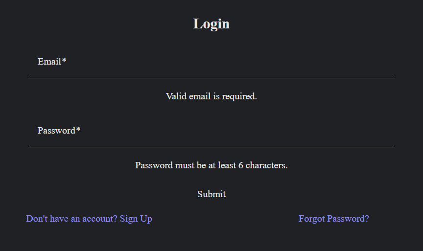
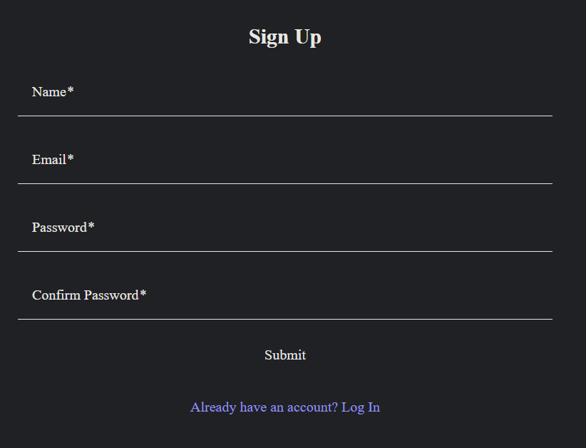
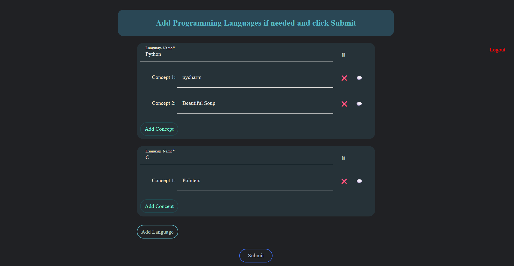
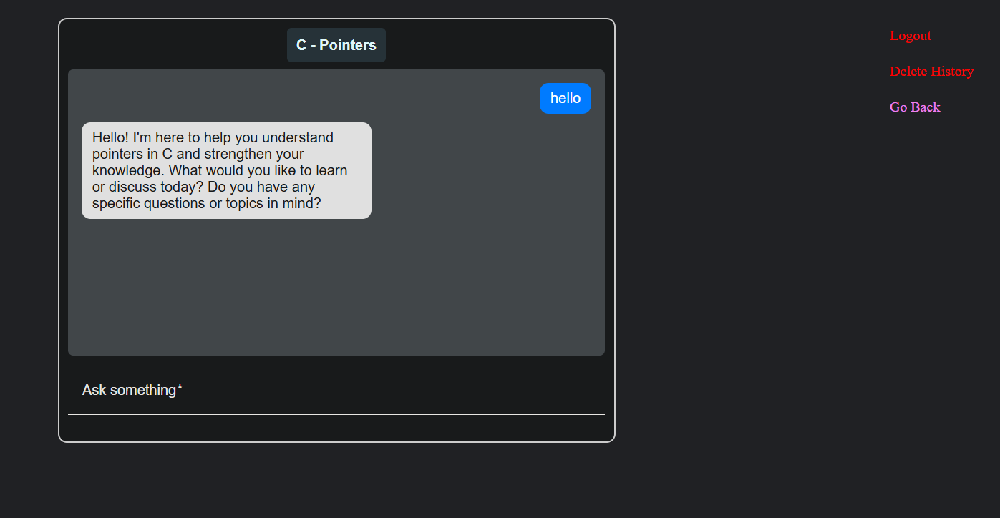

# 💡 ConceptAI

**ConceptAI** is an AI-powered chatbot web app that helps users learn and organize programming concepts across various languages. With an Angular frontend and Node.js + Express backend, ConceptAI integrates Google's Gemini API to deliver individualized, context-aware assistance on each concept you add.

Whether you're learning Python, JavaScript, Java, or any other language, ConceptAI provides a structured space to define concepts and receive smart, AI-generated guidance — like having a personal tutor for every coding idea.

---









---

## 🌟 Key Features

-   🧠 **Concept-based Chat**: Get AI help on individual programming concepts.
-   🌍 **Multi-language Support**: Add multiple programming languages and concepts under each.
-   🔐 **Secure User Auth**: Encrypted login system with JWT-based session management.
-   💬 **Persistent History**: Concept-specific conversations stored and restored across sessions.
-   🧰 **Modular Form Management**: Add, remove, and manage concepts and languages dynamically.
-   ⚙️ **Seamless Full-Stack Architecture**: Decoupled frontend and backend for scalability.

---

## 🧩 Project Structure

```
ConceptAI/
├── frontend/             # Angular application
│   └── src/
│       ├── environments
│           └── environment.ts
│       └── app/
|			├── pipes/
│           └── routes/
├── backend/              # Node.js + Express server
│   ├── controllers/
│   ├── routes/
│   ├── schemas/
│   └── .env
└── Readme.md             # You're here!
```

---

## 🚀 Getting Started

### 🔧 Frontend Setup

```bash
cd frontend
npm install
npm start
```

### 🔧 Backend Setup

```bash
cd backend
npm install
npm start
```

---

## 🔐 Environment Variables

Create a `.env` file in the `backend/` directory with:

```env
GEMINI_API_KEY=your_google_gemini_api_key
MongoDBUsername=your_mongodb_atlas_username
MongoDBPswd=your_mongodb_atlas_password
MongoDBClusterString=your_mongodb_cluster_string
SALT_WORK_FACTOR=your_salt_work_factor_for_bcrypt
EMAIL_HASH_SECRET=your_sha256_secret_key
ENCRYPTION_ALGORITHM=your_encryption_algorithm_for_auth_code
ENCRYPTION_KEY=your_32_bit_key_for_encrypting_auth_code
ENCRYPTION_IV=your_16_bit_IV_for_encrypting_auth_code
JWT_SECRET=your_jwt_encryption_key
EMAIL_USER=your_email_username
EMAIL_PASS=your_email_password
EMAIL_NAME=your_name
EMAIL_SMTP_HOST=your_smtp_host
EMAIL_SMTP_PORT=your_smtp_port
FRONTEND_URL=your_frontend_url
```

Create `environments/environment.ts` file in the `frontend/src/` directory with:

```env
export const environment = {
	apiUrl: your_backend_api_url,
};
```

---

## 🧠 Tech Stack

-   **Frontend**: Angular 20 + Angular Material
-   **Backend**: Node.js + Express
-   **Authentication**: SHA256 + bcrypt + JWT
-   **Database**: MongoDB with Mongoose
-   **AI**: Google Gemini API (Generative Language SDK)

---

## 🧠 Contributors

Built with ❤️ by **Keshav Garg**  
Based on **EssayHelper**, by me :D
